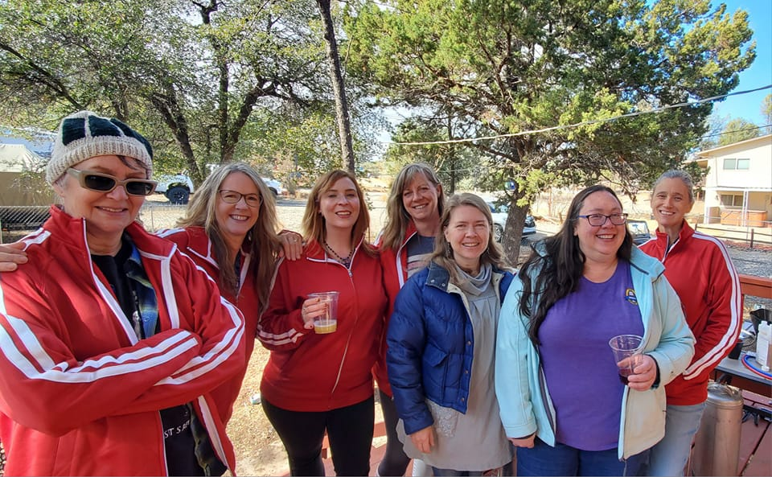

## You're Invited: Women's Learn to Brew Day! 🍻✨

Curious about brewing your own beer? Join us for a fun and relaxed Women’s Learn to Brew Day at Mike and Jodi’s ranch. Whether you're a complete beginner or have dabbled a little, this is a welcoming space to get hands-on with the brewing process, ask questions, and connect with other women who love craft beer (or are just brew-curious!). Men are invited to be seen and not heard unless asked. There will be a raffle to win a horse and goat.

🗓 Date: Sunday October 19, 2025  
🕒 Time: 10am-5pm  
📍 Location: 12515 N Tri V Ranch Rd, Prescott 86305  
(2 miles north of Outer Loop off of Williamson Valley Road)  
🍺 Bring drinks and something to eat or there’s Chubby Chucks sandwiches at the corner store.

No experience or equipment necessary—just bring your curiosity 🧐

