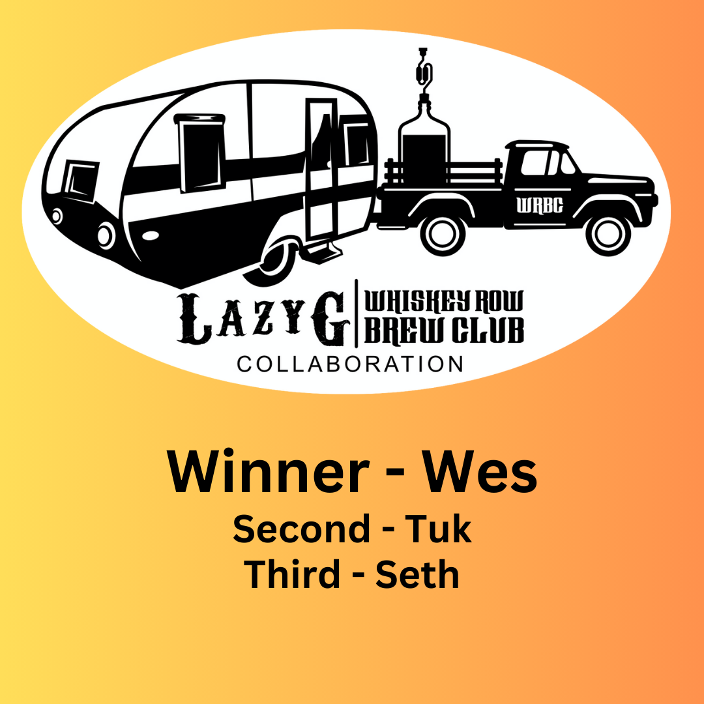

In a heated 5-entry competition, the judges selected our brewer of the year, Wes as the winner. His American Pale Ale will be brewed and served at Lazy G this summer and compete in the GABF Pro-Am competition in October. Watch for a tapping party in July or August!

Second place - Tuk
Third place - Seth

Congratulations all!